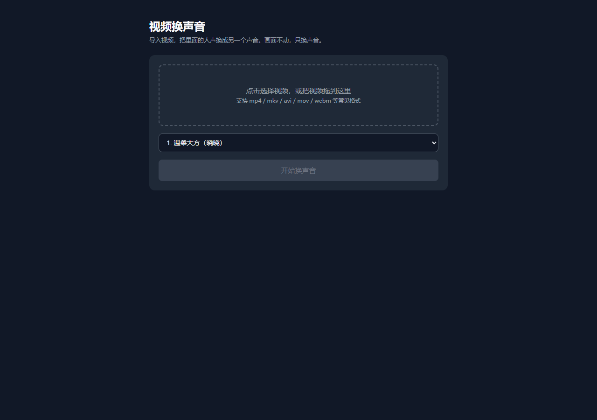

# swapvoice

**把任意视频里的声音换成另一个人的声音。** 不需要显卡、不需要训练模型、不需要 API key、完全免费。



[English](README.md) | 简体中文

## 原理

swapvoice 不是"变换"原声音，而是给视频**重新配音**：

```
视频 ──► 提取音频 ──► Whisper 语音识别（本地，CPU 或 GPU）──► 文字 + 时间戳
                                                                    │
新视频 ◄── 画面原样合回 ◄── 按时间戳对齐 ◄── 用新音色重新朗读（微软云端免费合成）
```

画面一个字节都不动，只重建音轨。新语音按原时间戳放回原位，你听到的就是另一个人在说一模一样的话。

## 功能

- **22 个真人音色** —— 普通话男女声、台湾腔、粤语、东北话、陕西话、英语（美音/英音）、日语、韩语
- **智能语言适配** —— 自动检测视频语言，与所选音色不匹配时按性别自动切换到对应语言的音色（覆盖 15 种语言）
- **GPU 自动探测** —— 有 NVIDIA 独显自动用 GPU 加速识别，没有就静默回退 CPU
- **两种使用方式** —— 拖拽式命令行，或本地网页版（上传进度、实时日志、内嵌预览播放器、一键下载）
- **2 个秒级变调模式** —— 不重新配音直接升调/降调；长视频自动按语音停顿切片并行处理，1 小时视频在 CPU 上约一分钟出结果
- **完全免费** —— 配音走微软 edge-tts 公开接口，识别在本地跑，无需任何账号密钥

## 性能

在**只有核显的笔记本**上实测（纯 CPU）：识别速度 **约 1.7 倍实时**（whisper-medium、int8、开 VAD、批量推理+词级时间戳），30 分钟视频全程约 25 分钟跑完。有 NVIDIA 显卡时识别环节还会快数倍。

## 安装

```bash
pip install -r requirements.txt
python download_model.py
```

- `download_model.py` 下载约 1.5GB 的 whisper-medium 模型（仅需一次）。默认走 `hf-mirror.com` 国内镜像，海外用户可设置 `HF_ENDPOINT=https://huggingface.co`
- 需要系统里有 **ffmpeg**：加入 `PATH`，或设置环境变量 `VOICECHANGER_FFMPEG` 指向它所在目录

## 使用

**命令行**（交互式选声音菜单）：

```bash
python change_voice.py 你的视频.mp4
```

**网页版**：

```bash
python web_server.py            # 打开 http://127.0.0.1:8765
python web_server.py --share    # 允许局域网访问
```

**Windows 快捷方式**：双击 `start-cli.bat` / `start-web.bat`，或把视频文件拖到 `start-cli.bat` 上。

成品保存在原视频旁边，文件名为 `原名_换声_音色.mp4`。

## 局限

- 背景音乐会被替换 —— 整条音轨由新语音重建
- 这是重新配音，不是音色克隆：新声音是 TTS 音色，不是原说话人音色的变换
- 识别准确度决定效果上限：识别错的字，重新配音后也会念错

## 许可

[MIT](LICENSE)
